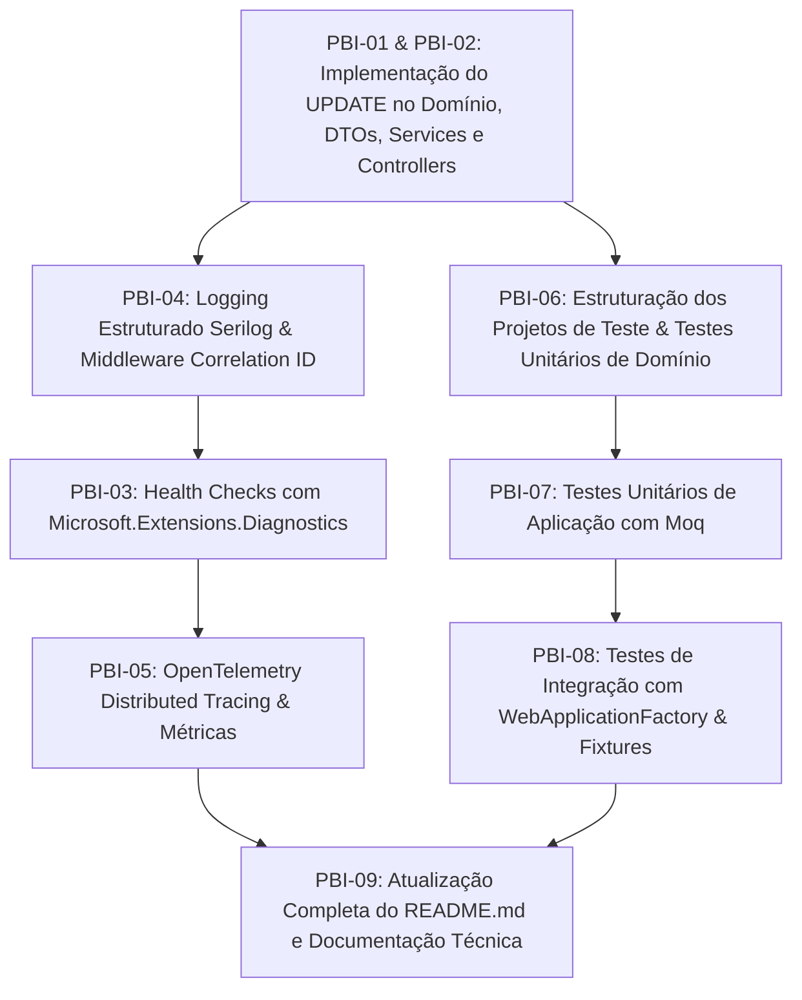

# 📋 Backlog Master Azure Boards — Sprint 3 (.NET & Observabilidade)

> **Projeto:** PetGuardian — Rede Colaborativa de Cuidado Animal  
> **Disciplina:** Advanced Business Development with .NET (FIAP — 2º Ano ADS)  
> **Sprint:** 3ª Sprint (Monitoramento, Observabilidade, Testes Automatizados AAA & Refatoração CRUD)  
> **Padrão:** Scrum Process Template (Azure DevOps / Azure Boards)

---

## 🧭 1. Resumo Executivo & Análise de Requisitos (Páginas 07 e 08)

Após auditoria detalhada dos requisitos do edital da **Sprint 3 (Páginas 07 e 08)** e inspeção minuciosa da base de código atual do **PetGuardian**, foram identificados os seguintes direcionamentos estratégicos e lacunas críticas:

### ⚠️ Gaps e Pontos Críticos Identificados no Projeto Atual:
1. **Ausência Completa de Endpoints de Atualização (`PUT`/Update):**
   * Nenhum dos Controllers (`PetController`, `UsuarioController`, `VeterinarioController`, `ClinicaController`, `AtendimentoController`, etc.) possui endpoints HTTP `PUT` implementados.
   * Não existem DTOs de Update (`PetUpdateRequest`, `UsuarioUpdateRequest`, etc.) nem métodos correspondentes nos contratos de serviço e na camada de domínio.
   * *Impacto:* Além de violar o padrão RESTful completo, a disciplina integrada de **DevOps (Página 12 e 14)** exige expressamente a demonstração de **Update/Alteração** no CRUD com evidência de `SELECT` no banco, sob pena de perda de até 30 pontos.
2. **Inexistência de Projetos de Testes Automatizados na Solution:**
   * A solução `.sln` contém apenas os projetos de produção (`API`, `Application`, `Domain`, `Infrastructure`). É obrigatório criar `PetGuardian.UnitTests` e `PetGuardian.IntegrationTests` separados por camada, com nomenclatura padronizada e Fixtures de contexto.
3. **Falta da Camada de Observabilidade & Monitoramento Corporativo:**
   * Ausência de `Health Checks` com `Microsoft.Extensions.Diagnostics.HealthChecks` para avaliar a saúde da API e a conectividade com o banco Oracle.
   * Ausência de logging estruturado com `Serilog` (Console/Arquivo) e middleware de `Correlation ID` (`X-Correlation-ID`).
   * Ausência de Distributed Tracing e Métricas com `OpenTelemetry` para monitorar tempos de resposta e taxa de erros entre camadas.

---

## 👑 2. Hierarquia Geral do Backlog (Azure Boards)

```text
[EPIC-01] PetGuardian - Plataforma .NET de Cuidado Colaborativo (Sprint 3)
│
├── [FEAT-01] Refatoração e Implementação Completa do CRUD (Operações de Update / PUT)
│   ├── [PBI-01] Implementação de Atualização (PUT) para Pet e Usuário (Cuidadores)
│   └── [PBI-02] Implementação de Atualização (PUT) para Atendimento, Tarefa, Veterinário e Clínica
│
├── [FEAT-02] Monitoramento, Observabilidade e Diagnóstico da Aplicação (40 pts)
│   ├── [PBI-03] Implementação de Health Checks Corporativos (API & Oracle Database)
│   ├── [PBI-04] Logging Estruturado com Serilog, Níveis de Log e Correlation ID
│   └── [PBI-05] Rastreamento Distribuído (Distributed Tracing) e Métricas com OpenTelemetry
│
├── [FEAT-03] Testes Automatizados no Padrão AAA com xUnit e WebApplicationFactory (50 pts)
│   ├── [PBI-06] Estruturação dos Projetos de Teste e Testes Unitários de Domínio (AAA)
│   ├── [PBI-07] Testes Unitários da Camada de Aplicação com Mocking de Dependências (Moq)
│   └── [PBI-08] Testes de Integração de Endpoints HTTP com WebApplicationFactory & Fixtures
│
└── [FEAT-04] Documentação Técnica, Guias de Execução e Atualização do README (10 pts)
    └── [PBI-09] Atualização da Documentação Técnica (README.md, Health Checks, Testes e OpenAPI)
```

---

## 📊 3. Tabela de Visão Geral, Story Points e Prioridades

| ID | Título do Item de Backlog (PBI) | Feature Pai | Story Points | Prioridade | Estimativa (Horas) |
| :--- | :--- | :--- | :---: | :---: | :---: |
| **PBI-01** | Implementação de Atualização (PUT) para Pet e Usuário | FEAT-01 (CRUD Update) | 5 pts | 1 - Critical | 7h |
| **PBI-02** | Implementação de Atualização (PUT) para Atendimento, Tarefa e Cadastros | FEAT-01 (CRUD Update) | 5 pts | 2 - High | 7h |
| **PBI-03** | Health Checks Corporativos (API, Oracle DB e Serviços) | FEAT-02 (Observabilidade) | 5 pts | 1 - Critical | 6h |
| **PBI-04** | Logging Estruturado com Serilog, Console/Arquivo e Correlation ID | FEAT-02 (Observabilidade) | 5 pts | 1 - Critical | 6h |
| **PBI-05** | Distributed Tracing e Métricas de Performance com OpenTelemetry | FEAT-02 (Observabilidade) | 5 pts | 2 - High | 7h |
| **PBI-06** | Estruturação de Testes e Testes Unitários de Domínio (AAA) | FEAT-03 (Testes AAA) | 5 pts | 1 - Critical | 8h |
| **PBI-07** | Testes Unitários de Aplicação com Mocking (Moq / NSubstitute) | FEAT-03 (Testes AAA) | 5 pts | 1 - Critical | 8h |
| **PBI-08** | Testes de Integração de Endpoints com WebApplicationFactory | FEAT-03 (Testes AAA) | 8 pts | 1 - Critical | 10h |
| **PBI-09** | Atualização do README.md com Guias de Health Check e Testes | FEAT-04 (Documentação) | 2 pts | 2 - High | 3h |
| **TOTAL** | **9 PBIs / 31 Child Tasks Técnicas** | — | **45 pts** | — | **62h** |

---

## 📦 4. Detalhamento dos Itens de Trabalho (Épicos, Features, PBIs e Tasks)

---

### 🏛️ ÉPICO
* **Work Item Type:** `Epic`
* **Title:** `[EPIC-01] PetGuardian - Plataforma .NET de Cuidado Colaborativo (Sprint 3)`
* **Description:** Evolução da plataforma ASP.NET Core PetGuardian incorporando camadas corporativas de observabilidade, monitoramento de saúde, logging correlacionado, telemetria distribuída, bateria completa de testes automatizados unitários e de integração no padrão AAA, além da consolidação do CRUD com operações de atualização (PUT).

---

### 🌟 FEATURE 01: Refatoração e Implementação Completa do CRUD (Operações de Update / PUT)
* **Work Item Type:** `Feature`
* **Parent:** `[EPIC-01] PetGuardian - Plataforma .NET de Cuidado Colaborativo (Sprint 3)`
* **Title:** `[FEAT-01] Refatoração e Implementação Completa do CRUD (Operações de Update / PUT)`
* **Description:** Completar o ciclo RESTful da API fornecendo endpoints de atualização (`PUT`), validação de dados, métodos de negócio em entidades de domínio e persistência no banco de dados Oracle via Entity Framework Core.

---

#### 🔹 [PBI-01] Implementação de Atualização (PUT) para Pet e Usuário (Cuidadores)
* **Work Item Type:** `Product Backlog Item`
* **Parent Feature:** `[FEAT-01] Refatoração e Implementação Completa do CRUD (Operações de Update / PUT)`
* **State:** `Approved`
* **Priority:** `1 - Critical`
* **Effort (Story Points):** `5`
* **Tags:** `DotNet`, `API`, `CRUD`, `Domain`, `Sprint3`

##### Descrição (História de Usuário)
> **Como** tutor ou cuidador participante de uma rede de cuidado animal,  
> **Eu quero** atualizar os dados cadastrais do meu perfil de usuário e as informações dos meus pets cadastrados (nome, idade, porte, castração e raça),  
> **Para que** as informações de identificação e saúde estejam sempre precisas e sincronizadas para todos os cuidadores vinculados.

##### Critérios de Aceite (Acceptance Criteria / Definition of Done)
- [ ] O endpoint `PUT /api/Pet/{id}` deve aceitar payload com os dados atualizáveis (`Nome`, `Idade`, `Porte`, `Castrado`, `RacaId`).
- [ ] Se o Pet não existir, o endpoint deve retornar HTTP `404 Not Found`.
- [ ] Validações de domínio devem ser respeitadas (ex: idade entre 0 e 99 anos, nome preenchido, raça existente). Em caso de violação, retornar HTTP `400 Bad Request`.
- [ ] O endpoint `PUT /api/Usuario/{id}` deve permitir alterar o `Nome` e `TelefoneId`, mantendo as regras de negócio de e-mail e hash seguro de senha.
- [ ] As respostas de sucesso devem retornar HTTP `200 OK` com o DTO de resposta atualizado (`PetResponse`, `UsuarioResponse`).
- [ ] A documentação OpenAPI/Swagger deve refletir os novos verbos `PUT` e os respectivos schemas de request/response.

##### Tarefas Técnicas (Child Tasks)
* **Task 1.1: Atualização dos Modelos de Domínio e Invariantes (Pet & Usuario)** *(Estimativa: 2h)*
  * *Descrição:* Criar métodos de negócio em `Pet.cs` (`AtualizarDados(string nome, int idade, PortePet porte, bool castrado, Guid racaId)`) e `Usuario.cs` para atualizar campos de forma encapsulada com validação.
* **Task 1.2: Criação dos DTOs de Update e Mapeamentos** *(Estimativa: 1.5h)*
  * *Descrição:* Criar `PetUpdateRequest.cs` e `UsuarioUpdateRequest.cs` na camada `PetGuardian.Application.DTOs` com Data Annotations para validação de entrada.
* **Task 1.3: Implementação dos Métodos de Update nos Services e Repositórios** *(Estimativa: 2h)*
  * *Descrição:* Atualizar as interfaces `IPetService`, `IUsuarioService` e suas implementações para buscar a entidade existente, invocar o método de domínio, persistir via repositório EF Core e retornar o DTO atualizado.
* **Task 1.4: Exposição dos Endpoints PUT nos Controllers (`PetController` e `UsuarioController`)** *(Estimativa: 1.5h)*
  * *Descrição:* Adicionar métodos `[HttpPut("{id:guid}")]` com anotações `[ProducesResponseType]`, validação de `ModelState` e documentação XML comments.

---

#### 🔹 [PBI-02] Implementação de Atualização (PUT) para Atendimento, Tarefa, Veterinário e Clínica
* **Work Item Type:** `Product Backlog Item`
* **Parent Feature:** `[FEAT-01] Refatoração e Implementação Completa do CRUD (Operações de Update / PUT)`
* **State:** `Approved`
* **Priority:** `2 - High`
* **Effort (Story Points):** `5`
* **Tags:** `DotNet`, `API`, `CRUD`, `Services`, `Sprint3`

##### Descrição (História de Usuário)
> **Como** administrador da clínica ou médico veterinário,  
> **Eu quero** editar os dados de atendimentos clínicos, detalhes de tarefas prescritas, cadastros de veterinários e clínicas parceiras,  
> **Para que** qualquer erro de digitação, alteração de diagnóstico ou reagendamento de cuidado possa ser retificado no sistema.

##### Critérios de Aceite (Acceptance Criteria / Definition of Done)
- [ ] Endpoints `PUT /api/Atendimento/{id}`, `PUT /api/Tarefa/{id}`, `PUT /api/Veterinario/{id}` e `PUT /api/Clinica/{id}` implementados e funcionais.
- [ ] Validações de integridade referencial mantidas (verificação de existência de Foreign Keys como `ClinicaId`, `VeterinarioId`, `PetId`, `TipoAtendId`).
- [ ] Em caso de ID inexistente, retornar status `404 Not Found`; dados inválidos devem retornar status `400 Bad Request`.
- [ ] Retorno `200 OK` contendo o payload atualizado nas requisições bem-sucedidas.

##### Tarefas Técnicas (Child Tasks)
* **Task 2.1: Criação dos DTOs de Update para Atendimento, Tarefa, Veterinário e Clínica** *(Estimativa: 2h)*
  * *Descrição:* Criar `AtendimentoUpdateRequest`, `TarefaUpdateRequest`, `VeterinarioUpdateRequest` e `ClinicaUpdateRequest` com regras de validação requeridas.
* **Task 2.2: Implementação dos Métodos de Atualização nas Entidades e Serviços de Aplicação** *(Estimativa: 3h)*
  * *Descrição:* Adicionar métodos de atualização em `AtendimentoService`, `TarefaService`, `VeterinarioService` e `ClinicaService`, validando chaves estrangeiras antes da persistência.
* **Task 2.3: Adição dos Endpoints PUT nos Controllers Correspondentes** *(Estimativa: 2h)*
  * *Descrição:* Atualizar `AtendimentoController`, `TarefaController`, `VeterinarioController` e `ClinicaController` com `[HttpPut("{id:guid}")]`, responses de Swagger e tipagens consistentes.

---

### 🌟 FEATURE 02: Monitoramento, Observabilidade e Diagnóstico da Aplicação (40 pts)
* **Work Item Type:** `Feature`
* **Parent:** `[EPIC-01] PetGuardian - Plataforma .NET de Cuidado Colaborativo (Sprint 3)`
* **Title:** `[FEAT-02] Monitoramento, Observabilidade e Diagnóstico da Aplicação`
* **Description:** Implementar a infraestrutura completa de observabilidade corporativa incluindo verificação de saúde (Health Checks), registro em log estruturado correlacionado por requisição (Serilog) e rastreamento distribuído com métricas de desempenho (OpenTelemetry).

---

#### 🔹 [PBI-03] Implementação de Health Checks Corporativos (API & Oracle Database)
* **Work Item Type:** `Product Backlog Item`
* **Parent Feature:** `[FEAT-02] Monitoramento, Observabilidade e Diagnóstico da Aplicação`
* **State:** `Approved`
* **Priority:** `1 - Critical`
* **Effort (Story Points):** `5`
* **Tags:** `DotNet`, `HealthChecks`, `Observability`, `Oracle`, `Sprint3`

##### Descrição (História de Usuário)
> **Como** engenheiro de DevOps e sustentação do sistema,  
> **Eu quero** que a API exponha endpoints padronizados de verificação de saúde (`/health`, `/health/ready`, `/health/live`),  
> **Para que** ferramentas de monitoramento e orquestradores (como Azure App Service e Kubernetes/Docker) possam identificar instantaneamente se a aplicação e o banco Oracle estão operacionais.

##### Critérios de Aceite (Acceptance Criteria / Definition of Done)
- [ ] Utilizar o pacote oficial `Microsoft.Extensions.Diagnostics.HealthChecks`.
- [ ] Endpoint `/health` (ou `/healthchecks`) configurado retornando status HTTP `200 OK` (quando `Healthy`) ou `503 Service Unavailable` (quando `Unhealthy`).
- [ ] Verificação de conectividade ativa com o banco de dados Oracle (`PetGuardianDbContext`) via EF Core Health Check ou query leve (`SELECT 1 FROM DUAL`).
- [ ] Endpoint de Liveness (`/health/live`) para indicar que o processo da API está ativo.
- [ ] Endpoint de Readiness (`/health/ready`) para validar a disponibilidade das dependências (Oracle DB).
- [ ] Resposta em formato JSON estruturado com status geral, tempo de resposta (`duration`), dados de cada dependência testada e timestamp.

##### Tarefas Técnicas (Child Tasks)
* **Task 3.1: Instalação de Pacotes NuGet de Health Checks** *(Estimativa: 1h)*
  * *Descrição:* Adicionar referências aos pacotes `Microsoft.Extensions.Diagnostics.HealthChecks`, `Microsoft.Extensions.Diagnostics.HealthChecks.EntityFrameworkCore` e `AspNetCore.HealthChecks.UI.Client` no projeto `PetGuardian.API`.
* **Task 3.2: Implementação de Health Check Customizado para Oracle DB** *(Estimativa: 2h)*
  * *Descrição:* Criar a classe `OracleDbHealthCheck` ou configurar `AddDbContextCheck<PetGuardianDbContext>()` para executar validação de conectividade com tratamento de timeout.
* **Task 3.3: Configuração dos Endpoints e Formatador JSON de Resposta no `Program.cs`** *(Estimativa: 2h)*
  * *Descrição:* Registrar os middlewares de HealthCheck (`/health`, `/health/ready`, `/health/live`) com `UIResponseWriter.WriteHealthCheckUIResponse` ou formatador customizado em JSON detalhado.
* **Task 3.4: Teste de Validação dos Health Checks em Cenários de Sucesso e Falha** *(Estimativa: 1h)*
  * *Descrição:* Executar testes manuais e automatizados simulando banco online (`Healthy`) e banco inacessível (`Unhealthy`).

---

#### 🔹 [PBI-04] Logging Estruturado com Serilog, Níveis de Log e Correlation ID
* **Work Item Type:** `Product Backlog Item`
* **Parent Feature:** `[FEAT-02] Monitoramento, Observabilidade e Diagnóstico da Aplicação`
* **State:** `Approved`
* **Priority:** `1 - Critical`
* **Effort (Story Points):** `5`
* **Tags:** `DotNet`, `Serilog`, `Logging`, `CorrelationID`, `Sprint3`

##### Descrição (História de Usuário)
> **Como** desenvolvedor e operador de infraestrutura,  
> **Eu quero** que todas as operações da API gerem logs estruturados em formato JSON/Console/Arquivo e possuam um Correlation ID exclusivo por requisição,  
> **Para que** eu possa rastrear todo o ciclo de vida de uma transação entre as camadas da aplicação e diagnosticar erros rapidamente em produção.

##### Critérios de Aceite (Acceptance Criteria / Definition of Done)
- [ ] Serilog configurado no `Program.cs` substituindo o logging padrão do .NET.
- [ ] Suporte a múltiplos níveis de log: `Information`, `Warning` e `Error`.
- [ ] Saída dupla configurada: Console formatado (com cores e propriedades) e Arquivo com rotação diária (`logs/petguardian-.log`).
- [ ] Middleware customizado `CorrelationIdMiddleware` implementado para interceptar o header `X-Correlation-ID` (ou gerar um novo `Guid` caso não seja fornecido).
- [ ] O `CorrelationId` deve ser adicionado ao `LogContext` do Serilog e retornado no cabeçalho de resposta HTTP `X-Correlation-ID`.
- [ ] O `GlobalExceptionHandler` deve registrar a exceção com nível `Error`, incluindo o stack trace, Correlation ID e rota da requisição.

##### Tarefas Técnicas (Child Tasks)
* **Task 4.1: Instalação e Configuração dos Pacotes do Serilog** *(Estimativa: 1.5h)*
  * *Descrição:* Instalar `Serilog.AspNetCore`, `Serilog.Sinks.Console`, `Serilog.Sinks.File` e `Serilog.Enrichers.Environment`/`Thread` no `PetGuardian.API`.
* **Task 4.2: Implementação do Middleware de Correlação (`CorrelationIdMiddleware`)** *(Estimativa: 2h)*
  * *Descrição:* Criar `CorrelationIdMiddleware.cs` para ler/gerar o `CorrelationId`, injetar no `LogContext.PushProperty("CorrelationId", ...)` e adicionar ao `context.Response.Headers`.
* **Task 4.3: Configuração de Sinks, Filtros e Rotação de Arquivos no `appsettings.json`** *(Estimativa: 1.5h)*
  * *Descrição:* Definir configurações de Serilog no `appsettings.json` e `Program.cs` com rolling interval diário, retenção de arquivos e enriquecedores padrão.
* **Task 4.4: Integração dos Logs nos Services e no `GlobalExceptionHandler`** *(Estimativa: 1h)*
  * *Descrição:* Injetar `ILogger<T>` nos serviços essenciais (`TarefaService`, `PetService`, `AtendimentoService`) e enriquecer os logs de exceções globais.

---

#### 🔹 [PBI-05] Distributed Tracing e Métricas de Performance com OpenTelemetry
* **Work Item Type:** `Product Backlog Item`
* **Parent Feature:** `[FEAT-02] Monitoramento, Observabilidade e Diagnóstico da Aplicação`
* **State:** `Approved`
* **Priority:** `2 - High`
* **Effort (Story Points):** `5`
* **Tags:** `DotNet`, `OpenTelemetry`, `Tracing`, `Metrics`, `Sprint3`

##### Descrição (História de Usuário)
> **Como** arquiteto de software e time de SRE,  
> **Eu quero** rastrear requisições através de Distributed Tracing e expor métricas de desempenho (tempo de resposta, taxa de erros e throughput),  
> **Para que** gargalos de performance nas consultas e chamadas de serviço sejam identificados com precisão.

##### Critérios de Aceite (Acceptance Criteria / Definition of Done)
- [ ] Pacotes `OpenTelemetry.Extensions.Hosting`, `OpenTelemetry.Instrumentation.AspNetCore` e `OpenTelemetry.Instrumentation.Http` configurados no projeto.
- [ ] Distributed Tracing instrumentando requisições HTTP de entrada e chamadas de saída.
- [ ] Métricas de desempenho expostas: tempo de resposta da requisição (`http.server.request.duration`), taxa de erros e contadores de operações.
- [ ] Exportador configurado (Console Exporter ou OTLP/Prometheus endpoint `/metrics`).
- [ ] Spans nomeados adequadamente refletindo a operação e as camadas executadas.

##### Tarefas Técnicas (Child Tasks)
* **Task 5.1: Adição de Dependências do OpenTelemetry na API** *(Estimativa: 1.5h)*
  * *Descrição:* Instalar pacotes NuGet do OpenTelemetry (`OpenTelemetry.Extensions.Hosting`, `OpenTelemetry.Instrumentation.AspNetCore`, `OpenTelemetry.Instrumentation.EntityFrameworkCore`, `OpenTelemetry.Exporter.Console` / `Prometheus.AspNetCore`).
* **Task 5.2: Configuração de Tracing e Métricas no Pipeline de Injeção de Dependências** *(Estimativa: 2.5h)*
  * *Descrição:* Configurar `builder.Services.AddOpenTelemetry()` com `.WithTracing(...)` e `.WithMetrics(...)` no `Program.cs` ou extensão `ObservabilityExtensions.cs`.
* **Task 5.3: Instrumentação Customizada de Métricas de Negócio (ActivitySource & Meter)** *(Estimativa: 2h)*
  * *Descrição:* Criar contadores customizados (`tarefas_concluidas_total`, `atendimentos_criados_total`, `erros_negocio_total`) para métricas de negócio do PetGuardian.
* **Task 5.4: Teste e Validação da Emissão de Traces e Métricas** *(Estimativa: 1h)*
  * *Descrição:* Executar requisições de teste na API e validar a geração correta dos spans e coleta de métricas nos logs/console.

---

### 🌟 FEATURE 03: Testes Automatizados no Padrão AAA com xUnit e WebApplicationFactory (50 pts)
* **Work Item Type:** `Feature`
* **Parent:** `[EPIC-01] PetGuardian - Plataforma .NET de Cuidado Colaborativo (Sprint 3)`
* **Title:** `[FEAT-03] Testes Automatizados no Padrão AAA com xUnit e WebApplicationFactory`
* **Description:** Implementação de suíte abrangente de testes automatizados com cobertura das camadas de Domínio e Aplicação (testes unitários com Moq) e testes de integração de ponta a ponta para os endpoints da API com WebApplicationFactory e Fixtures.

---

#### 🔹 [PBI-06] Estruturação dos Projetos de Teste e Testes Unitários de Domínio (AAA)
* **Work Item Type:** `Product Backlog Item`
* **Parent Feature:** `[FEAT-03] Testes Automatizados no Padrão AAA com xUnit e WebApplicationFactory`
* **State:** `Approved`
* **Priority:** `1 - Critical`
* **Effort (Story Points):** `5`
* **Tags:** `DotNet`, `xUnit`, `UnitTests`, `Domain`, `AAA`, `Sprint3`

##### Descrição (História de Usuário)
> **Como** desenvolvedor de software,  
> **Eu quero** projetos de teste dedicados e organizados por camada com testes unitários cobrindo as entidades e regras de domínio no padrão AAA,  
> **Para que** as invariantes de negócio (como validação de idade de pets, pontuação de tarefas e regras de cuidadores) permaneçam protegidas contra regressões.

##### Critérios de Aceite (Acceptance Criteria / Definition of Done)
- [ ] Criação dos projetos `PetGuardian.UnitTests` e `PetGuardian.IntegrationTests` adicionados à solution `PetGuardian.sln`.
- [ ] Todos os testes unitários devem seguir rigorosamente o padrão **AAA (Arrange, Act, Assert)** com blocos comentados.
- [ ] Nomenclatura uniforme e padronizada em todos os testes: `MetodoTestado_Cenario_ResultadoEsperado`.
- [ ] Cobertura completa de entidades do Domínio (`Pet`, `Usuario`, `Tarefa`, `Atendimento`, `Clinica`, `Veterinario`).
- [ ] Testes validando fluxos de sucesso e lançamento de `DomainException` em cenários de dados inválidos (ex: pet com nome vazio, idade negativa, usuário sem e-mail válido).

##### Tarefas Técnicas (Child Tasks)
* **Task 6.1: Criação e Configuração dos Projetos de Testes no .NET** *(Estimativa: 1.5h)*
  * *Descrição:* Criar `PetGuardian.UnitTests.csproj` e `PetGuardian.IntegrationTests.csproj` com target `net10.0`, instalando `xunit`, `xunit.runner.visualstudio`, `FluentAssertions` e `Microsoft.NET.Test.Sdk`.
* **Task 6.2: Implementação dos Testes Unitários da Entidade `Pet` (AAA)** *(Estimativa: 2h)*
  * *Descrição:* Cobrir criação com dados válidos, atualização de idade, castração e lançamento de exceções para limites de caracteres e idade inválida.
* **Task 6.3: Implementação dos Testes Unitários da Entidade `Usuario` e `Tarefa` (AAA)** *(Estimativa: 2.5h)*
  * *Descrição:* Testar validação de e-mail, senha mínima, métodos de conclusão de tarefas, atribuição de executor e transição de status.
* **Task 6.4: Implementação dos Testes Unitários de `Atendimento`, `Veterinario` e `Clinica` (AAA)** *(Estimativa: 2h)*
  * *Descrição:* Testar construtores, métodos de atualização de dados e validações de campos obrigatórios.

---

#### 🔹 [PBI-07] Testes Unitários da Camada de Aplicação com Mocking de Dependências (Moq)
* **Work Item Type:** `Product Backlog Item`
* **Parent Feature:** `[FEAT-03] Testes Automatizados no Padrão AAA com xUnit e WebApplicationFactory`
* **State:** `Approved`
* **Priority:** `1 - Critical`
* **Effort (Story Points):** `5`
* **Tags:** `DotNet`, `xUnit`, `Moq`, `ApplicationServices`, `AAA`, `Sprint3`

##### Descrição (História de Usuário)
> **Como** desenvolvedor de software,  
> **Eu quero** testar os serviços da camada de aplicação (`PetService`, `TarefaService`, `UsuarioService`, `AtendimentoService`) utilizando mocks para os repositórios,  
> **Para que** a orquestração de regras de negócio, cálculo de scores de gamificação e validações de existência sejam validadas de forma isolada e ultra-rápida.

##### Critérios de Aceite (Acceptance Criteria / Definition of Done)
- [ ] Uso do framework `Moq` (ou `NSubstitute`) para simulação de todos os repositórios e dependências.
- [ ] Testes do método `TarefaService.Concluir`:
  * Usuário não cadastrado (`InvalidOperationException`).
  * Usuário não pertencente ao círculo de cuidadores do pet (`InvalidOperationException`).
  * Tarefa já concluída previamente (`InvalidOperationException`).
  * Sucesso na conclusão com transição de status para `CONCLUIDO` e chamada a `Update()`.
- [ ] Testes do método `UsuarioService.GetScore` validando o somatório de pontos das tarefas concluídas.
- [ ] Testes dos métodos de `Create`, `Update`, `GetById` e `Delete` de todos os serviços.

##### Tarefas Técnicas (Child Tasks)
* **Task 7.1: Configuração do Moq e Helpers de Teste de Serviços** *(Estimativa: 1.5h)*
  * *Descrição:* Configurar pacote `Moq` no projeto de testes e criar métodos utilitários/Builders para criação rápida de instâncias de teste.
* **Task 7.2: Implementação de Testes Unitários para `TarefaService` (Cenários Críticos)** *(Estimativa: 2.5h)*
  * *Descrição:* Testar todos os ramos de decisão do método `Concluir`, criação de tarefas com verificação de existência de Pet e Veterinário, e filtros de busca.
* **Task 7.3: Implementação de Testes Unitários para `UsuarioService` e Gamificação/Score** *(Estimativa: 2h)*
  * *Descrição:* Testar fluxos de cadastro de usuário, unicidade/busca por e-mail e cálculo do score cumulativo individual.
* **Task 7.4: Implementação de Testes Unitários para `PetService` e `AtendimentoService`** *(Estimativa: 2h)*
  * *Descrição:* Testar operações de CRUD, listagens por raça, histórico clínico consolidado e tratamento de entidades não encontradas.

---

#### 🔹 [PBI-08] Testes de Integração de Endpoints HTTP com WebApplicationFactory & Fixtures
* **Work Item Type:** `Product Backlog Item`
* **Parent Feature:** `[FEAT-03] Testes Automatizados no Padrão AAA com xUnit e WebApplicationFactory`
* **State:** `Approved`
* **Priority:** `1 - Critical`
* **Effort (Story Points):** `8`
* **Tags:** `DotNet`, `IntegrationTests`, `WebApplicationFactory`, `Fixtures`, `Sprint3`

##### Descrição (História de Usuário)
> **Como** desenvolvedor e responsável por QA,  
> **Eu quero** testes de integração ponta a ponta executando contra o pipeline HTTP real da API via `WebApplicationFactory`,  
> **Para que** todo o ciclo de vida HTTP (roteamento, validação de ModelState, injeção de dependências, tratamento de exceções global e respostas 200/201/204/400/404) seja homologado antes do deploy.

##### Critérios de Aceite (Acceptance Criteria / Definition of Done)
- [ ] Projeto `PetGuardian.IntegrationTests` configurado com `Microsoft.AspNetCore.Mvc.Testing` (`WebApplicationFactory<Program>`).
- [ ] Implementação de `CustomWebApplicationFactory` substituindo a conexão Oracle física por um banco em memória (`UseInMemoryDatabase` ou SQLite) para execução isolada e confiável.
- [ ] Uso de **Fixtures** e **Collection Fixtures** (`IClassFixture`, `ICollectionFixture`) para inicialização única e compartilhamento de contexto/HttpClient entre testes.
- [ ] Testes de integração cobrindo o fluxo completo:
  * `POST /api/Pet` com retorno `201 Created` e header `Location`.
  * `GET /api/Pet/{id}` com retorno `200 OK` e `404 Not Found`.
  * `PUT /api/Pet/{id}` com atualização persistida com sucesso (`200 OK`).
  * `DELETE /api/Pet/{id}` com retorno `204 NoContent`.
  * `POST /api/Tarefa/{id}/concluir` validando o fluxo de conclusão de tarefas.
  * Validação do `GlobalExceptionHandler` retornando RFC 7807 (`ProblemDetails`) em casos de erro.
- [ ] Validação de que todos os testes rodam com sucesso via comando `dotnet test`.

##### Tarefas Técnicas (Child Tasks)
* **Task 8.1: Configuração da `CustomWebApplicationFactory` e Banco In-Memory** *(Estimativa: 2.5h)*
  * *Descrição:* Criar a classe `CustomWebApplicationFactory<TProgram>` customizando `ConfigureServices` para usar `InMemoryDbContext` e semear dados básicos (status, raças, tipos de atendimento).
* **Task 8.2: Criação de Test Fixtures e Coleções do xUnit** *(Estimativa: 2h)*
  * *Descrição:* Criar classes de Fixture (`IntegrationTestFixture`, `DatabaseFixture`) e anotação `[CollectionDefinition("IntegrationTests")]` para reutilização otimizada.
* **Task 8.3: Implementação dos Testes de Integração de `PetController` e `UsuarioController`** *(Estimativa: 2.5h)*
  * *Descrição:* Testar endpoints de CRUD completo (POST, GET, PUT, DELETE), validando status codes e corpo da resposta JSON.
* **Task 8.4: Implementação dos Testes de Integração de `TarefaController`, `AtendimentoController` e Erros Globais** *(Estimativa: 3h)*
  * *Descrição:* Testar fluxos de conclusão de tarefa, listagens com relacionamentos e validação de `ProblemDetails` para requisições com dados inválidos (400) e não encontradas (404).

---

### 🌟 FEATURE 04: Documentação Técnica, Guias de Execução e Atualização do README (10 pts)
* **Work Item Type:** `Feature`
* **Parent:** `[EPIC-01] PetGuardian - Plataforma .NET de Cuidado Colaborativo (Sprint 3)`
* **Title:** `[FEAT-04] Documentação Técnica, Guias de Execução e Atualização do README`
* **Description:** Atualizar toda a documentação do repositório para refletir a nova arquitetura de observabilidade, catálogo de endpoints de Health Check, novos endpoints de Update do CRUD e instruções passo a passo para execução da suíte de testes automatizados via CLI.

---

#### 🔹 [PBI-09] Atualização da Documentação Técnica (README.md, Health Checks, Testes e OpenAPI)
* **Work Item Type:** `Product Backlog Item`
* **Parent Feature:** `[FEAT-04] Documentação Técnica, Guias de Execução e Atualização do README`
* **State:** `Approved`
* **Priority:** `2 - High`
* **Effort (Story Points):** `2`
* **Tags:** `Documentation`, `README`, `HealthChecks`, `xUnit`, `Sprint3`

##### Descrição (História de Usuário)
> **Como** professor avaliador e desenvolvedor novato no projeto,  
> **Eu quero** um README.md completo com explicações das novas ferramentas de monitoramento, tabela de endpoints e comandos CLI para execução dos testes automatizados,  
> **Para que** eu possa avaliar, executar e testar a aplicação de maneira imediata e sem atritos.

##### Critérios de Aceite (Acceptance Criteria / Definition of Done)
- [ ] Seção detalhada no `README.md` documentando os endpoints de Health Check (`/health`, `/health/ready`, `/health/live`) com payloads de exemplo.
- [ ] Documentação do Logging Estruturado (Serilog) e como consultar logs em arquivo e console.
- [ ] Documentação do OpenTelemetry (Distributed Tracing e Métricas expostas).
- [ ] Instruções claras e executáveis para rodar os testes unitários e de integração (`dotnet test`, `dotnet test --logger "console;verbosity=detailed"`).
- [ ] Atualização da tabela de endpoints da API no README incluindo as novas rotas `PUT` implementadas.
- [ ] Verificação de integridade dos links de repositório e integrantes.

##### Tarefas Técnicas (Child Tasks)
* **Task 9.1: Redação das Seções de Observabilidade e Health Checks no README** *(Estimativa: 1h)*
  * *Descrição:* Descrever arquitetura de monitoramento, dependências monitoradas e exemplos de saída JSON dos endpoints de saúde.
* **Task 9.2: Redação do Guia de Execução de Testes Automatizados no README** *(Estimativa: 1h)*
  * *Descrição:* Incluir comandos do CLI `dotnet test`, explicação da estrutura de projetos (Unit e Integration) e padrão AAA com Fixtures.
* **Task 9.3: Atualização do Catálogo de Endpoints e Diagramas de Arquitetura** *(Estimativa: 1h)*
  * *Descrição:* Atualizar a listagem de endpoints RESTful com os métodos `PUT` e os links de documentação Swagger.

---

## 🎯 5. Plano de Entrega e Sequência de Implementação Recomendada

Para garantir um fluxo ágil e sem retrabalho, a implementação deve seguir a seguinte ordem de dependência técnica:



---

## 📋 6. Checklist de Conformidade com a Grade de Avaliação FIAP (100 Pts)

* [x] **1. Monitoramento e Observabilidade (40 pts)**
  * [x] Health Checks de API, Banco Oracle e Dependências com `Microsoft.Extensions.Diagnostics.HealthChecks` *(15 pts)* ➔ **PBI-03**
  * [x] Logging Estruturado com Serilog (Info, Warning, Error), Console/Arquivo e Correlation ID *(10 pts)* ➔ **PBI-04**
  * [x] Distributed Tracing e Métricas com OpenTelemetry / Application Insights *(15 pts)* ➔ **PBI-05**
* [x] **2. Testes Automatizados – Padrão AAA (50 pts)**
  * [x] Testes Unitários com xUnit + Moq nas camadas de Domínio e Aplicação com padrão AAA *(20 pts)* ➔ **PBI-06 e PBI-07**
  * [x] Testes de Integração de endpoints com `WebApplicationFactory` *(15 pts)* ➔ **PBI-08**
  * [x] Organização por camadas (Unit/Integration), nomenclatura padronizada e Fixtures de contexto *(15 pts)* ➔ **PBI-06, PBI-07 e PBI-08**
* [x] **3. Atualização do README (10 pts)**
  * [x] Documentação de Health Checks, comandos `dotnet test` e descrição geral atualizada *(10 pts)* ➔ **PBI-09**
* [x] **Requisito Transversal & Alinhamento DevOps:**
  * [x] Implementação de `PUT` (Update) em todas as entidades core garantindo CRUD completo de ponta a ponta ➔ **PBI-01 e PBI-02**
