# 🐾 PetGuardian

> **Advanced Business Development with .NET**
> 
> API REST em .NET 10 desenvolvida para facilitar o **cuidado colaborativo de pets**. Focada na gestão de tarefas de saúde prescritas por veterinários, círculos de cuidado compartilhados, histórico clínico unificado e gamificação baseada em pontos.

---

## 🛠️ Tecnologias & Badges


---

## Repositório Github | Extra Vídeo rodando no Azure

[Repositório Github](https://github.com/Challenge-Pet-Guardian/Advanced-Business-Development-with-Dot-Net) | [Vídeo rodando no Azure](https://youtu.be/-527YLVrnPA?si=3yqv67g0ibO2n-Ds)


---

## 👥 Integrantes


<table>
<tr>
<th>Nome</th>
<th>RM</th>
<th>Turma</th>
<th>GitHub</th>
<th>LinkedIn</th>
</tr>

<tr>
<td>Enzo Okuizumi</td>
<td>561432</td>
<td>2TDSPG</td>
<td><a href="https://github.com/EnzoOkuizumiFiap">EnzoOkuizumiFiap</a></td>
<td><a href="https://www.linkedin.com/in/enzo-okuizumi-b60292256/">Enzo Okuizumi</a></td>
</tr>

<tr>
<td>Lucas Barros Gouveia</td>
<td>566422</td>
<td>2TDSPG</td>
<td><a href="https://github.com/LuzBGouveia">LuzBGouveia</a></td>
<td><a href="https://www.linkedin.com/in/lucas-barros-gouveia-09b147355/">Lucas Barros Gouveia</a></td>
</tr>

<tr>
<td>Milton Marcelino</td>
<td>564836</td>
<td>2TDSPG</td>
<td><a href="https://github.com/MiltonMarcelino">MiltonMarcelino</a></td>
<td><a href="http://linkedin.com/in/milton-marcelino-250298142">Milton Marcelino</a></td>
</tr>

<tr>
<td>Luna de Carvalho Guimarães</td>
<td>562290</td>
<td>2TDSPG</td>
<td><a href="https://github.com/lunaguima">lunaguima</a></td>
<td><a href="https://www.linkedin.com/in/luna-m-guimar%C3%A3es-1850ab173/">Luna M. Guimarães</a></td>
</tr>

<tr>
<td>Gustavo Okada</td>
<td>563428</td>
<td>2TDSPG</td>
<td><a href="https://github.com/Gdev3356">GustavoOkada7268</a></td>
<td><a href="https://www.linkedin.com/in/gustavo-okada-53a3b8359/">Gustavo Okada</a></td>
</tr>

</table>

---

## 💡 Sobre o Produto

O **PetGuardian** foi concebido para resolver o problema da descentralização do cuidado diário de animais domésticos quando mais de um cuidador está envolvido. A plataforma organiza responsabilidades, registra o histórico de saúde e incentiva a realização de tarefas através de um sistema gamificado.

### 🌟 Pilares do Domínio
* **Círculo de Cuidado Colaborativo:** Vínculo dinâmico `N:N` entre cuidadores (`Usuario`) e `Pet` via tabela associativa gerenciada.
* **Tarefas Prescritas com Pontuação:** Divisão de tarefas diárias com pontuação proporcional à complexidade.
* **Histórico Clínico Unificado:** Consolidação cronológica decrescente contendo atendimentos veterinários e tarefas concluídas.
* **Gamificação:** Score cumulativo individual para os cuidadores à medida que realizam os cuidados.

### 🗄️ Modelagem Lógica e Relacional do Banco de Dados

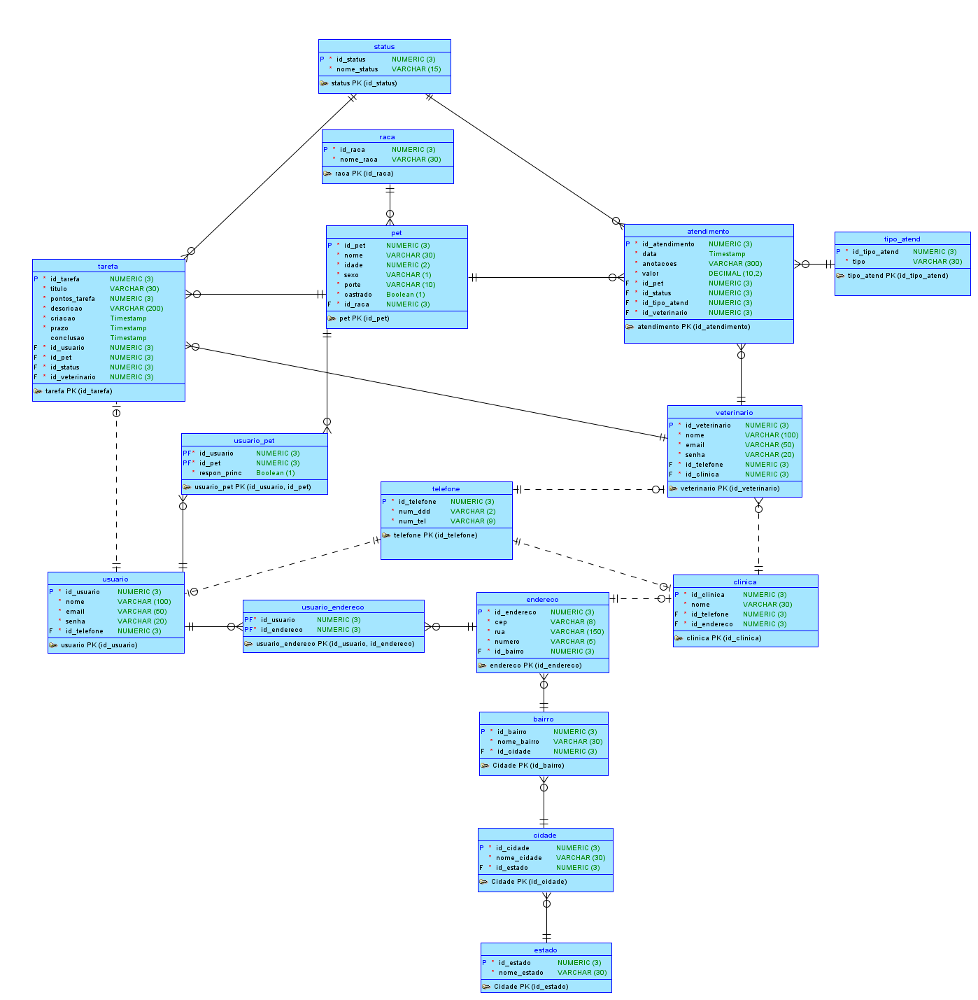


---

## 📂 Estrutura do Repositório

```text
PetGuardian/
  ├── PetGuardian.API/         # Endpoints, Middlewares e Injeção de Dependência
  ├── PetGuardian.Application/ # Camada de Aplicação (DTOs, Regras de Negócio e Serviços)
  ├── PetGuardian.Domain/      # Entidades Core de Domínio e Invariantes
  ├── PetGuardian.Infrastructure/ # Persistência (EF Core, Configurações Oracle e Migrations)
  └── docker-compose.yml       # Orquestração do Banco Oracle + API na VM Azure
```

---

## ⚙️ Regras de Negócio Implementadas

### 🔒 Governança e Círculos de Cuidado
* **Responsabilidade Principal:** Cada pet possui um cuidador marcado como **Responsável Principal** (`respon_princ = 'S'`).
* **Gestão de Convites:** Apenas o Responsável Principal pode emitir convites para outros cuidadores entrarem na rede do pet (seja por `ID` ou por `E-mail`).
* **Salvaguarda do Pet:** O sistema bloqueia a saída ou exclusão do último Responsável Principal de um pet, impedindo que o animal fique sem um cuidador principal ativo.

### 🎮 Gamificação e Cuidado Diário
* **Ciclo da Tarefa:** Tarefas de saúde e rotina nascem sem executor. Qualquer usuário participante da rede daquele pet pode assumir a tarefa e, posteriormente, marcá-la como concluída.
* **Score de Usuário:** Ao concluir uma tarefa, os pontos vinculados a ela (`PontosTarefa`) são somados dinamicamente ao score acumulado do cuidador.

### 🏥 Histórico de Saúde
* O endpoint `/api/pet/{id}/historico` agrupa de forma unificada os atendimentos médicos (clínicos) e as tarefas cotidianas já realizadas, apresentando uma linha do tempo ordenada da mais recente para a mais antiga.

### 📍 Resolução de Endereço Automática (ViaCEP)
* O cadastro de endereços (`POST /api/endereco`) requer apenas `Cep` e `Numero`. O sistema realiza o consumo externo transparente da API ViaCEP para preencher os dados de `Bairro`, `Cidade` e `Estado`. 
* Evita redundância de dados no banco reaproveitando instâncias idênticas de localizações já cadastradas.

---

## 🚀 Como Executar o Projeto

> A API está configurada com a **execução automática de migrations no startup** (`context.Database.Migrate()`). Você não precisa rodar comandos de criação de tabelas manualmente ao subir os containers.

### Opção A: Execução com Docker Compose (VM Azure / Local)

Ideal para implantação rápida na VM Azure ou testes locais sem necessidade de banco externo.

1. Navegue até o diretório do projeto:
   ```bash
   cd PetGuardian
   ```
2. Inicie os containers em segundo plano:
   ```bash
   docker compose up --build -d
   ```
3. Acesse a aplicação:
   * **API Swagger UI:** `http://localhost:8080/index.html` (ou via IP da VM: `http://<IP-VM-AZURE>:8080/index.html`)

---

### Opção B: Execução Local (Desenvolvimento sem Docker)

1. **Configuração de Secrets (Banco Oracle da FIAP):**
   No terminal, na pasta `PetGuardian.API`, execute:
   ```powershell
   dotnet user-secrets set "ConnectionStrings:PetGuardianOracle" "User Id=RMxxxxxx;Password=xxxxxx;Data Source=oracle.fiap.com.br:1521/orcl;" --project .\PetGuardian.API
   ```
2. **Atualização da Base de Dados:**
   ```powershell
   dotnet ef database update --project .\PetGuardian.Infrastructure --startup-project .\PetGuardian.API
   ```
3. **Execução:**
   ```powershell
   dotnet run --project .\PetGuardian.API
   ```
   * A API estará disponível no Swagger local em: `http://localhost:5289/index.html`

### 📸 Evidências de Inicialização e Migrações

#### Execução das Migrations (EF Core):
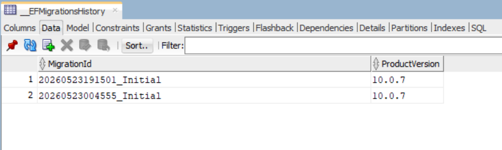
  
#### Tabelas Criadas com Sucesso no Banco de Dados:
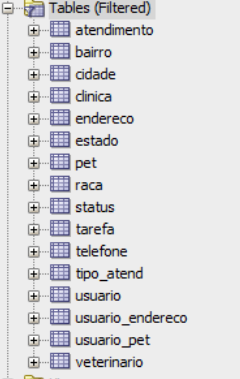

## 🗄️ Estrutura das Tabelas Principais (Oracle Database)

### 👥 Tabelas de Cuidadores e Contato
* **Tabela `usuario`:**
  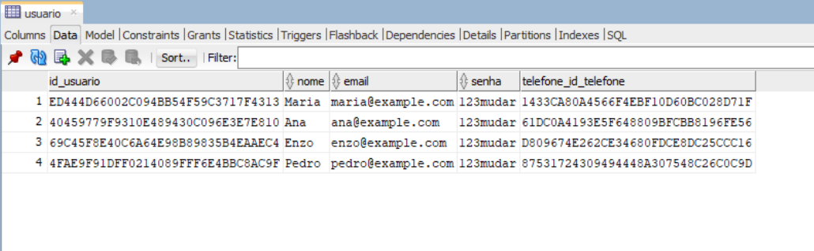
* **Tabela `telefone`:**
  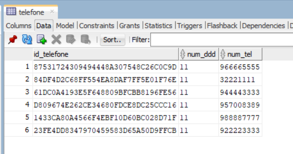

### 📍 Tabelas de Endereço e Localização
* **Tabela `endereco`:**
  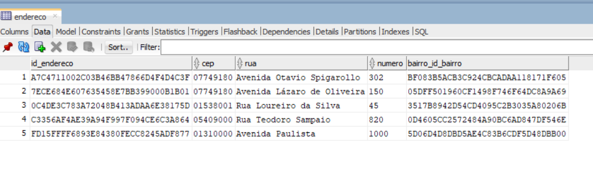
* **Tabela `bairro`:**
  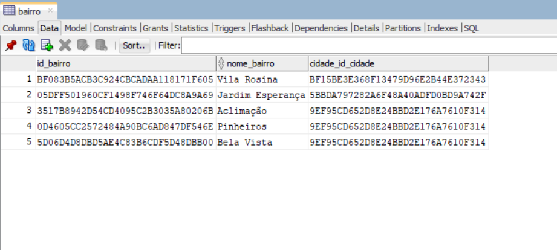
* **Tabela `cidade`:**
  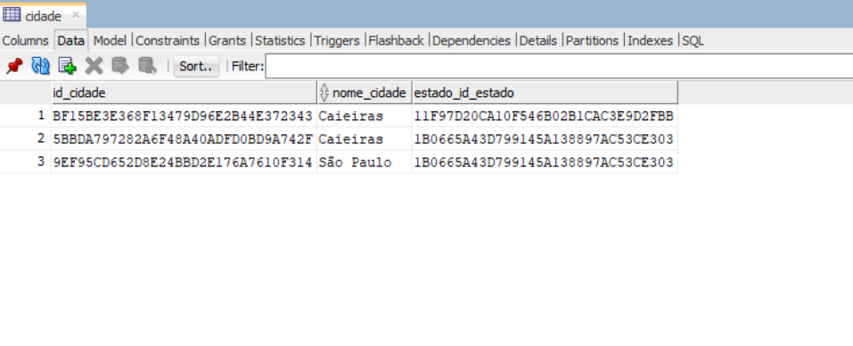
* **Tabela `estado`:**
  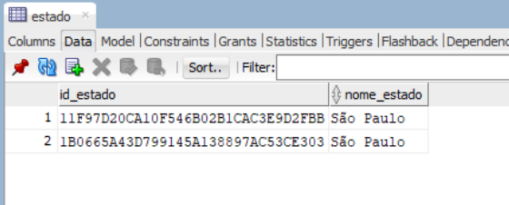
* **Tabela Associativa `usuario_endereco`:**
  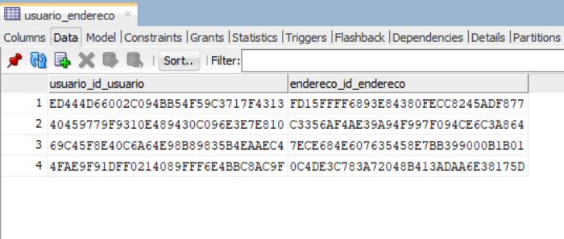

### 🐾 Tabelas de Pets e Raças
* **Tabela `pet`:**
  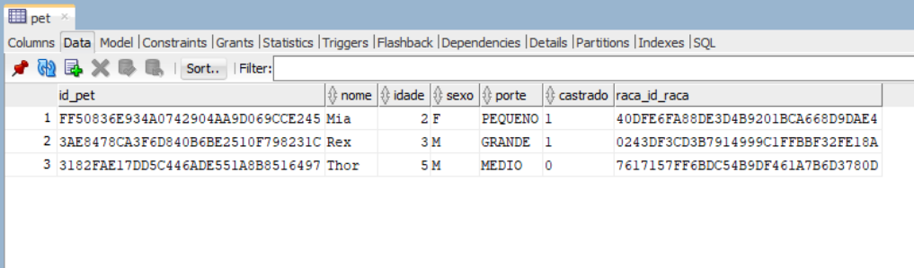
* **Tabela `raca`:**
  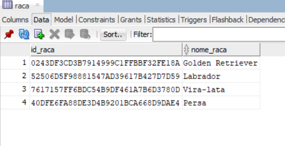
* **Tabela Associativa `usuario_pet` (Rede de Cuidado):**
  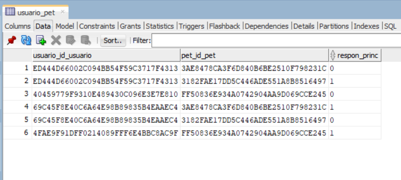

### 🏥 Tabelas de Atendimento Clínico e Veterinários
* **Tabela `clinica`:**
  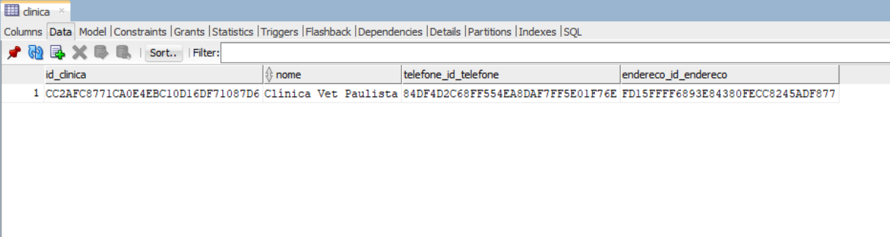
* **Tabela `veterinario`:**
  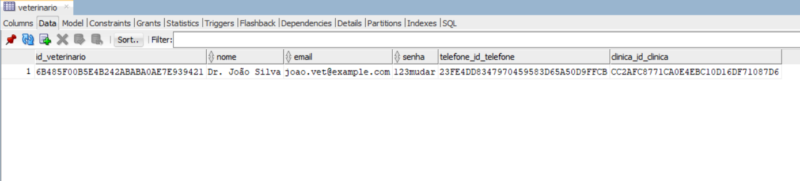
* **Tabela `atendimento`:**
  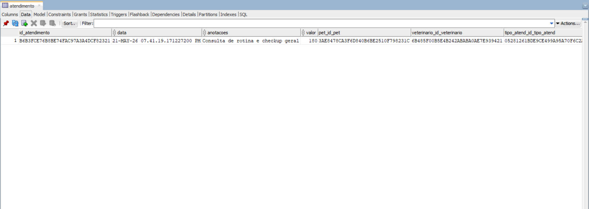
* **Tabela `tipo_atend` (Tipos de Atendimentos):**
  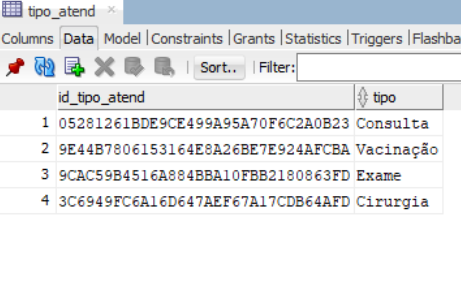

### 🎮 Tabelas de Tarefas e Estados
* **Tabela `tarefa`:**
  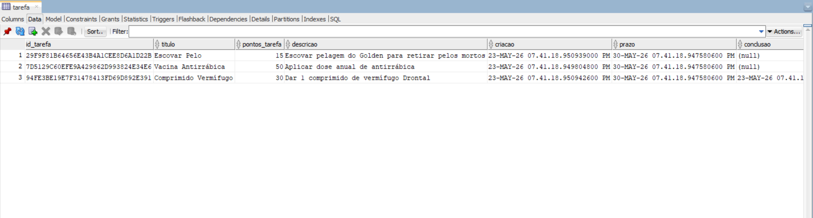
* **Tabela `status` (Status de Tarefas e Atendimentos):**
  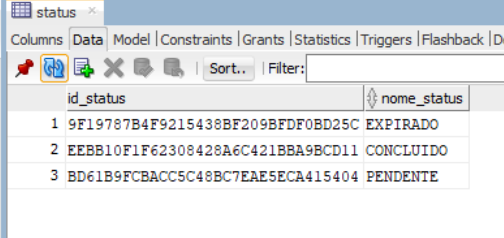


---

## 📋 Documentação de Rotas (OpenAPI / Swagger)

### Usuários
| Método | Rota | Descrição |
|--------|------|-----------|
| GET | /api/usuario | Listar todos os usuários |
| GET | /api/usuario/{id} | Buscar usuário por ID |
| GET | /api/usuario/by-email | Buscar usuário por e-mail |
| GET | /api/usuario/{id}/score | Buscar score e progresso do usuário |
| POST | /api/usuario | Cadastrar um novo usuário |
| DELETE | /api/usuario/{id} | Remover um usuário |

### Pets
| Método | Rota | Descrição |
|--------|------|-----------|
| GET | /api/pet | Listar todos os pets |
| GET | /api/pet/{id} | Buscar pet por ID |
| GET | /api/pet/by-raca/{racaId} | Buscar pets por raça |
| GET | /api/pet/{id}/historico | Buscar histórico clínico e de cuidados do pet |
| POST | /api/pet | Cadastrar um novo pet |
| DELETE | /api/pet/{id} | Remover um pet |

### Rede de Cuidado (UsuarioPet)
| Método | Rota | Descrição |
|--------|------|-----------|
| GET | /api/usuariopet | Listar todos os vínculos de rede de cuidado |
| GET | /api/usuariopet/by-usuario/{usuarioId} | Listar pets vinculados a um usuário |
| GET | /api/usuariopet/by-pet/{petId} | Listar cuidadores vinculados a um pet |
| GET | /api/usuariopet/rede-cuidado/{usuarioId} | Buscar rede de cuidado colaborativo de um usuário |
| POST | /api/usuariopet | Vincular um usuário a um pet |
| POST | /api/usuariopet/invite/by-usuario | Convidar cuidador por ID (Exclusivo para Responsável Principal) |
| POST | /api/usuariopet/invite/by-email | Convidar cuidador por E-mail (Exclusivo para Responsável Principal) |
| DELETE | /api/usuariopet/{usuarioId}/{petId} | Remover cuidador da rede de um pet |

### Tarefas de Cuidado
| Método | Rota | Descrição |
|--------|------|-----------|
| GET | /api/tarefa | Listar todas as tarefas |
| GET | /api/tarefa/{id} | Buscar tarefa por ID |
| GET | /api/tarefa/by-pet/{petId} | Listar tarefas de um pet |
| GET | /api/tarefa/by-usuario/{usuarioId} | Listar tarefas vinculadas a um usuário |
| GET | /api/tarefa/by-veterinario/{veterinarioId} | Listar tarefas prescritas por um veterinário |
| GET | /api/tarefa/by-status/{statusId} | Listar tarefas por status |
| POST | /api/tarefa | Prescrever/cadastrar uma nova tarefa para um pet |
| POST | /api/tarefa/{id}/concluir | Concluir tarefa (computando os pontos para o score do usuário) |
| DELETE | /api/tarefa/{id} | Deletar uma tarefa |

### Atendimentos Clínicos
| Método | Rota | Descrição |
|--------|------|-----------|
| GET | /api/atendimento | Listar todos os atendimentos |
| GET | /api/atendimento/{id} | Buscar atendimento por ID |
| GET | /api/atendimento/by-pet/{petId} | Listar atendimentos de um pet |
| GET | /api/atendimento/by-veterinario/{veterinarioId} | Listar atendimentos por veterinário |
| POST | /api/atendimento | Cadastrar um novo atendimento clínico |
| DELETE | /api/atendimento/{id} | Deletar um atendimento |

### Veterinários
| Método | Rota | Descrição |
|--------|------|-----------|
| GET | /api/veterinario | Listar todos os veterinários |
| GET | /api/veterinario/{id} | Buscar veterinário por ID |
| GET | /api/veterinario/by-email | Buscar veterinário por e-mail |
| GET | /api/veterinario/by-clinica/{clinicaId} | Listar veterinários vinculados a uma clínica |
| POST | /api/veterinario | Cadastrar um novo veterinário |
| DELETE | /api/veterinario/{id} | Remover um veterinário |

### Clínicas Veterinárias
| Método | Rota | Descrição |
|--------|------|-----------|
| GET | /api/clinica | Listar todas as clínicas |
| GET | /api/clinica/{id} | Buscar clínica por ID |
| POST | /api/clinica | Cadastrar uma nova clínica |
| DELETE | /api/clinica/{id} | Remover uma clínica |

### Endereços
| Método | Rota | Descrição |
|--------|------|-----------|
| GET | /api/endereco | Listar todos os endereços |
| GET | /api/endereco/{id} | Buscar endereço por ID |
| POST | /api/endereco | Cadastrar endereço buscando dados automaticamente via ViaCEP |
| DELETE | /api/endereco/{id} | Remover um endereço |

### Vínculo de Endereço (UsuarioEndereco)
| Método | Rota | Descrição |
|--------|------|-----------|
| GET | /api/usuarioendereco | Listar todas as relações usuário-endereço |
| GET | /api/usuarioendereco/by-usuario/{usuarioId} | Listar endereços vinculados a um usuário |
| GET | /api/usuarioendereco/by-endereco/{enderecoId} | Listar usuários vinculados a um endereço |
| POST | /api/usuarioendereco | Vincular um endereço a um usuário |
| DELETE | /api/usuarioendereco/{usuarioId}/{enderecoId} | Desvincular endereço de um usuário |

### Telefones
| Método | Rota | Descrição |
|--------|------|-----------|
| GET | /api/telefone | Listar todos os telefones |
| GET | /api/telefone/{id} | Buscar telefone por ID |
| POST | /api/telefone | Cadastrar um novo telefone |
| DELETE | /api/telefone/{id} | Remover um telefone |

### Raças de Pets
| Método | Rota | Descrição |
|--------|------|-----------|
| GET | /api/raca | Listar todas as raças |
| GET | /api/raca/{id} | Buscar raça por ID |
| POST | /api/raca | Cadastrar uma nova raça |
| DELETE | /api/raca/{id} | Remover uma raça |

### Cidades
| Método | Rota | Descrição |
|--------|------|-----------|
| GET | /api/cidade | Listar todas as cidades |
| GET | /api/cidade/{id} | Buscar cidade por ID |
| GET | /api/cidade/by-estado/{estadoId} | Listar cidades de um estado |
| POST | /api/cidade | Cadastrar uma nova cidade |
| DELETE | /api/cidade/{id} | Remover uma cidade |

### Bairros
| Método | Rota | Descrição |
|--------|------|-----------|
| GET | /api/bairro | Listar todos os bairros |
| GET | /api/bairro/{id} | Buscar bairro por ID |
| GET | /api/bairro/by-cidade/{cidadeId} | Listar bairros de uma cidade |
| POST | /api/bairro | Cadastrar um novo bairro |
| DELETE | /api/bairro/{id} | Remover um bairro |

### Estados
| Método | Rota | Descrição |
|--------|------|-----------|
| GET | /api/estado | Listar todos os estados |
| GET | /api/estado/{id} | Buscar estado por ID |
| POST | /api/estado | Cadastrar um novo estado |
| DELETE | /api/estado/{id} | Remover um estado |

### Status
| Método | Rota | Descrição |
|--------|------|-----------|
| GET | /api/status | Listar todos os status |
| GET | /api/status/{id} | Buscar status por ID |
| POST | /api/status | Cadastrar um novo status |
| DELETE | /api/status/{id} | Remover um status |

### Tipos de Atendimento
| Método | Rota | Descrição |
|--------|------|-----------|
| GET | /api/tipoatend | Listar todos os tipos de atendimento |
| GET | /api/tipoatend/{id} | Buscar tipo de atendimento por ID |
| POST | /api/tipoatend | Cadastrar um novo tipo de atendimento |
| DELETE | /api/tipoatend/{id} | Remover um tipo de atendimento |
